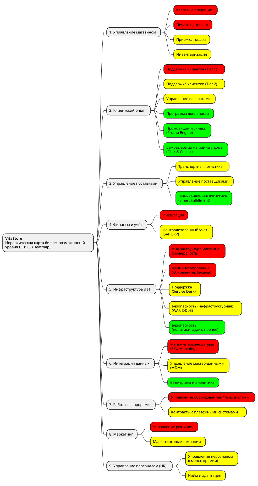

# Иерархическая карта бизнес-возможностей уровня L1 и L2 (Heatmap)

Карта бизнес возможностей окрашена по принципу:

* 🔴 RED (Commodity) — дорого, не даёт конкурентного преимущества, нужно выносить в SaaS

* 🟡 YELLOW (Critical but standard) — критично, но можно оптимизировать через PaaS/управляемые сервисы

* 🟢 GREEN (Differentiator) — конкурентное преимущество, оставляем In-house, развиваем

Текущий статус в VitaStore:

1. **Управление магазином**  
  Локальный толстый клиент + ручной труд

2. **Клиентский опыт**  
  Разрозненно: лояльность ведется локально в тетрадках, промоакции и скидки есть в едином движке HQ, Click & Collect - конкурентное преимущество

3. **Управление поставками**  
  Разрозненно: омниканальная логистика есть в HQ, но есть и локальные поставщики которые работают в разнобой

4. **Финансы и учёт**  
  SAP ERP on-premise в HQ, но интеграция с магазинами через ночные выгрузки, никакой автоматизации

5. **Инфраструктура и IT**  
  500 локальных серверов (+ постоянно новые) и платные лицензии на ПО, 40% бюджета на поддержку

6. **Интеграция данных**  
  Скрипт VLOOKUP + много ручной работы, 2 недели на магазин, 80% ручного труда

7. **Работа с вендорами**  
  Разнородные терминалы самых разных вендоров, до 3 недель на каждый новый драйвер

8. **Маркетинг**  
  Мы рассматриваем только IT-функцию, а не сам процесс и операционную деятельность. Поэтому что касается управления кампаниями - это может вестись через единую CRM

9. **Управление персоналом (HR)**  
  Было разрозненно, но после слияния точек магазинов должно вестись в централизованной системе вроде SAP HR
