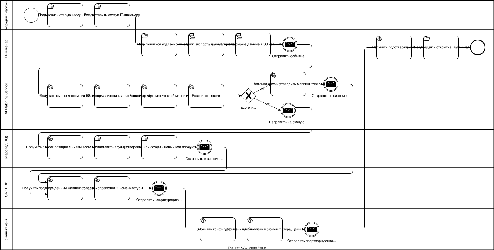
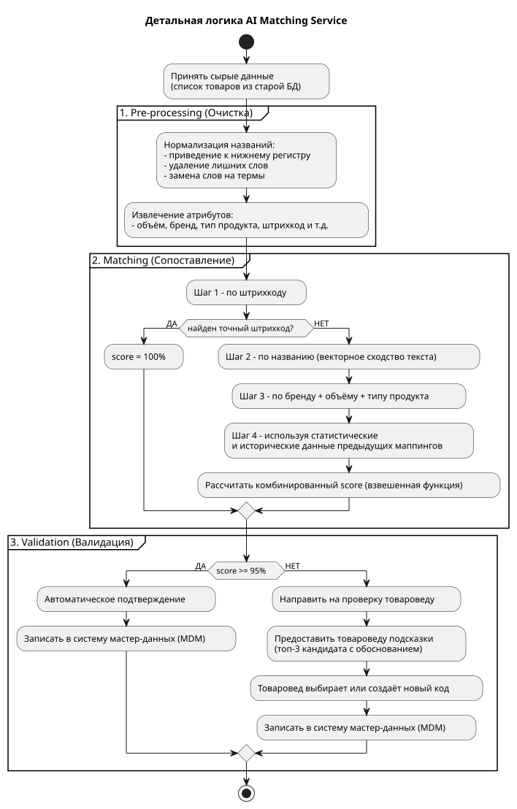

# Проектирование целевого процесса онбординга магазина

Для оптимизации бизнес-процесса определим этапы текущего (AS-IS) процесса, которые надо исправить.

| Этап | Проблема, траты (Waste) | Вариант решения |
| -- | -- | -- |
| Инженер физически едет в магазин | Время в пути, допрасходы на дорогу | **Удалённый сбор данных** (например, через защищённый VPN-туннель или облачный агент) |
| Ручной экспорт CSV/XLS | Ошибки выгрузки, у каждого магазина свой формат | **Коннектор к старой БД** (поддерживаем MySQL, PostgreSQL, MS SQL, 1C, ...) |
| Ручная отправка файла по email | Задержки, ручной триггер | **API-шлюз** (загрузка в облачное хранилище с автоматическим запуском пайплайна) |
| VLOOKUP + ручной маппинг товаров | 80% позиций вручную, 15% ошибок | **ML-сервис** (для маппинга + правила по штрихкодам и т.п.) |
| Загрузка в SAP | Ручной импорт | **API-интеграция** (автоматическая загрузка в SAP из пайплайна) |
| Ночной FTP на все магазины | Задержка на 1 день | **Real-time синхронизация обновлений** (например, через API или CDC) |

## Цель автоматизации

Сократить время интеграции нового магазина с **2 недель** до **5 дней** за счёт:

* Удалённого сбора данных (выезд ИТ-инженера исключён)
* ML-автоматизации маппинга номенклатуры
* Верификации только для сомнительных позиций

## Описание To-Be процесса

Разделим процесс на 4 фазы:

| Фаза | Длительность | Этапы |
| -- | -- | -- |
| **Data Ingestion** | < 6 часа | 1. Удалённое подключение к старой БД 2. Выгрузка базы номенклатуры 3. Загрузка в облачное хранилище |
| **Intelligent Matching** | < 4 часа | ML-сервис выполняет автоматический маппинг: 1. Препроцессинг по очистке данных 2. Нормализация 3. Извлечение ключевых атрибутов 4. Матчинг 5. Вычисление score матчинга |
| **Verification** | < 4 часа | 1. Товаровед проверяет только позиции со score < 95%, остальное автоматически утверждается (товаровед выбирает или создает новый товар) 2. Автоматически подтвержденный или проверифицированный человеком товар заносится в систему управления мастер-данными (MDM) |
| **Deployment** | < 2 часа | 1. Система формирует новый набор данных для магазинов и рассылает их 2. Клиент в магазине принимает новую конфигурацию (цена, номенклатура и т.д.) 3. Отправляется подтверждение об успешном развертывании |

**Итого: < 16 часов (вместо 2 недель).**

Ниже представлена BPMN диаграмма предложенного целевого процесса.

Более детально алгоритм сопоставления товаров с использованием AI показан на схеме ниже.

Как можно видеть из алгоритма, 100% сопоставление при машинном матчинге происходит только если совпал штрих-код товара. Если же совпадения не найдено, то система должна выполнить дополнительные шаги:

* Шаг 2 - по названию (векторное сходство текста).  
  Такой подход с нечеткой логикой может дать коэффициент схожести порядка 80-95%.
* Шаг 3 - по ключевым атрибутам (бренду + объёму + типу продукта).  
  Такой подход может дать коэффициент схожести порядка 70-90%.
* Шаг 4 - используя статистические и исторические данные предыдущих маппингов.  
  Такой подход может дать коэффициент схожести порядка 85-95%.  
  Это статистический подход к маппингу товаров на основе обучения (обратная связь в этой цепи - это информацию о результате маппинга сложных товаров товароведом).

По итогу вычисляется взвешенная функция с неким коэффициентом "уверенности".

## Описание точки верификации

Человек (товаровед в HQ) участвует только на этапе проверки позиций со с коэффициентом "уверенности" < 95%. При этом система должна предоставить ему подсказки, чтобы облегчить ручной труд.

* Товаровед получает уведомление о наличии неразобранных товаров.
* Через веб-интерфейс системы загружается список "сомнительных" позиций.
* Система также показывает топ-3 наиболее вероятных кандидата из базы VitaStore.
* Товаровед выбирает правильный вариант или создаёт новый мастер-код для товара.
* После подтверждения маппинг сохраняется в MDM и используется для обучения ML-модели.

Это значительно снижает нагрузку на человека и объем ручного труда, как и требовалось из цели автоматизации процесса.

Предположительно распределение должно быть таким (окончательную оценку удастся получить после реализации системы):

* ~80-90% позиций маппятся автоматически (score > 95%).
* ~10-15% требуют ручной проверки (товары без штрихкодов, с новыми штрихкодами и т.д.).
* ~1-2% новых товаров, которых нет в базе VitaStore. Такие товары создаются товароведом в базе номенклатуры товаров.

## Итог

Таким образом, за счет автоматизации бизнес-процесса ожидаем получить:

1. Время интеграции магазина.  
  **Было** 2 недели.  
  **Стало** менее 5 дней.
2. Доля ручного маппинга.  
  **Было** 80%.  
  **Стало** менее 15%.
3. Ошибки маппинга.  
  **Было** 15%.  
  **Стало** менее 2%.
4. Командировки ИТ-инженеров.  
  **Было** каждый вновь подключаемый магазин.  
  **Стало** 0 (интеграция проводится удаленно).
