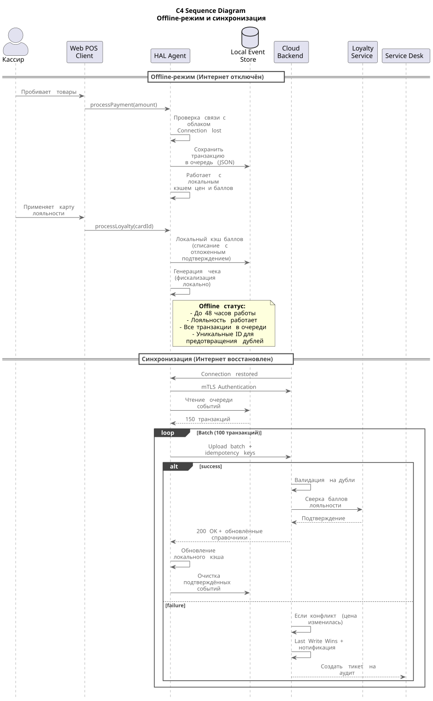

# Механизм работы офлайн-режима и синхронизации данных

## Принцип работы офлайн-режима

При обрыве интернет-соединения система переходит в **Offline Mode** с сохранением полной функциональности для операций с наличными:

1. **Локальный кэш справочников**  
   HAL-агент и Web POS Client хранят актуальную копию товарных справочников (цены, промо и т.д.) в Local Event Store (SQLite). Кэш обновляется при каждом успешном соединении и содержит данные минимум на **48 часов** работы.
2. **Очередь событий (Event Sourcing)**  
   Все транзакции (чеки, продажи, возвраты и т.д.) записываются в локальную очередь событий с временными метками. Каждое событие получает уникальный ID (UUID) и сохраняется в структурированном виде (JSON) в Local Event Store.
3. **Работа с лояльностью**  
   В офлайн-режиме система использует локальный кэш балансов лояльности, который синхронизируется при последнем успешном соединении. Карты лояльности работают в режиме "накопление/списание с отложенным подтверждением". При восстановлении связи транзакции лояльности отправляются в центральный сервис для окончательной сверки.
4. **Фискализация**  
   Фискальный регистратор работает в штатном режиме офлайн. Все чеки печатаются локально.

## Синхронизация при восстановлении связи

При восстановлении интернет-соединения запускается автоматический процесс синхронизации в строгом порядке:

1. **Authentication + Handshake**  
   HAL-агент проходит mTLS-аутентификацию с бэкендом в облаке и проверяет целостность локальных данных.
2. **Upload транзакций**  
   Система отправляет все события из очереди в облачный бекенд в порядке их создания (FIFO). Используется batch-загрузка (до 100 событий за раз) для минимизации количества запросов.
3. **Валидация и резолвинг конфликтов**  
   * Облачный бекенд проверяет каждую транзакцию на дубликаты (по уникальному ID (UUID) события).
   * В случае несоответствия (например, цена изменилась с момента офлайн-продажи) используется стратегия "Last Write Wins" с нотификацией в Service Desk для ручного аудита.
   * Операции лояльности отправляются в Loyalty Service для окончательного списания/начисления баллов.

4. **Обновление локального кэша**  
   После успешной синхронизации облачный бекенд возвращает актуальные справочники (цены, промо, остатки и т.д.), и HAL-агент обновляет Local Event Store для будущих офлайн-сессий.
5. **Мониторинг и алертинг**  
   В случае, если синхронизация не удалась после N попыток, создается тикет в Service Desk для ручного вмешательства.

При этом необходимо обеспечить целостность данных. Для этого необходимо обеспечить как минимум:

* Используется Idempotency Keys для предотвращения дублирования транзакций.
* Все события сохраняются в WAL (Write-Ahead Log) на Edge-устройстве.
* Автоматическое уведомление в Service Desk при любых конфликтах, требующих ручного аудита.

Приблизительная диаграмма последовательности Offline-Mode представлена ниже:

