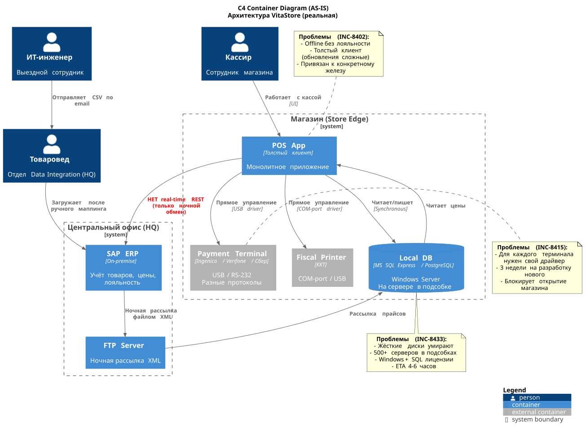
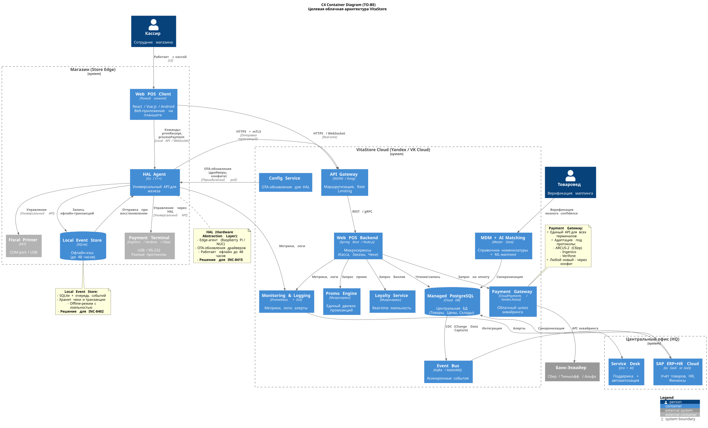
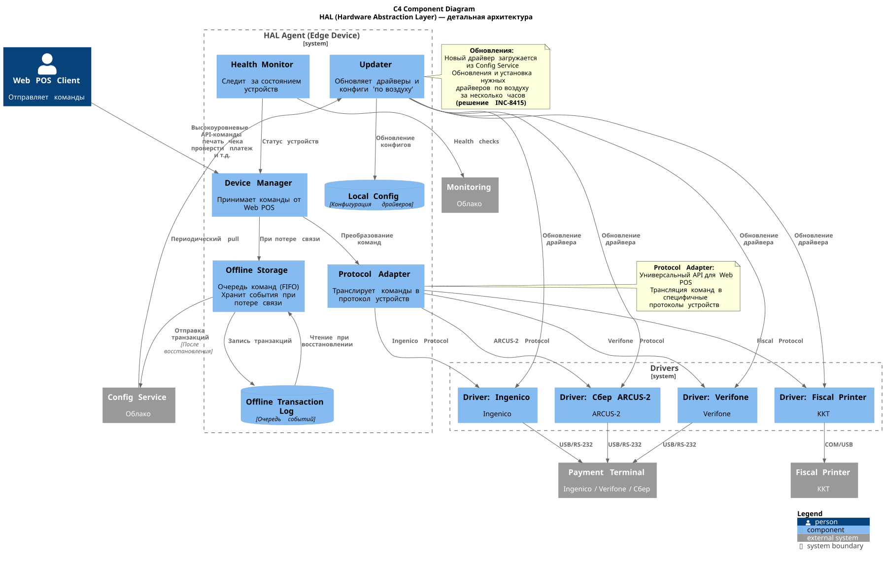

# Разработка целевой облачной архитектуры

После анализа исходных артефактов задания и архитекторной схемы, можно утверждать, что **Артефакт 1** врёт, и мы это знаем из Артефактов 2 и 3.

Актуальная архитектура AS-IS будет выглядеть так

Выявлены следующие ключевые проблемы:

1. 500+ локальных серверов
2. Толстый клиент
3. Разнородные терминалы
4. Обновления драйверов
5. Интеграция новых магазинов
6. Отсутствие нормального Offline-режима

Вариант архитектуры TO-BE будет выглядеть следующим образом:

## Ключевые архитектурные решения

### 1. Отказ от локальных (On-Premise) серверов

Все локальные БД заменяются на **Managed PostgreSQL** в облаке (например, Yandex Cloud).

Это позволит решить следующие проблемы:

* Ликвидация лицензий Windows Server и SQL (экономия ~30% TCO)
* Управляемый бэкап, репликация, failover (отказоустойчивость)
* Решение проблемы INC-8433 (мёртвые жёсткие диски)

### 2. Отказ от толстых клиентов и переход на Web POS

Снимет значительную часть расходов по управлению, администрированию, доработкам и поддержке.

Получаем универсальный **Web POS Client** — веб-приложение на планшете

### 3. Hardware Abstraction Layer (HAL)

Это решение проблемы разнородного железа, внедрение Edge-агента (на базе, например, Raspberry Pi или Intel NUC) с универсальным API для управления ККТ и платёжными терминалами.

Это позволит получить преимущества:

* Web POS отправляет команды HAL на универсальном языке (например, `printReceipt()`, `processPayment(amount)` и т.д.).
* HAL транслирует команды в конкретные протоколы устройств (ARCUS-2, Ingenico, Verifone) через загружаемые драйверы.
* Получить обновления "по воздуху" (Over-The-Air, OTA). Новый драйвер для терминала, если уже разработан, загружается из облачного Config Service за минуты/часы (вместо 3 недель разработки для каждого конкретного толстого клиента, как в INC-8415).
* Добавление нового типа терминала — это просто конфигурация номенклатуры, программ лояльности, промо и т.д, а не пересборка кассового приложения. Конфигурацию можно также загружать "по воздуху" с сервера из облака, например, выполняя периодический polling.

Детали варианта HAL-уровня показаны на схеме ниже:

### 4. Offline-режим с Event Sourcing

HAL-агент и Web POS Client используют **Local Event Store** (SQLite) для работы при потере интернета, а затем синхронизация по восстановлении связи. Данные (цены, промо, баллы лояльности и т.д.) должны кэшироваться на срок до 48 часов. Все транзакции сохраняются в порядке очереди (FIFO) с уникальным ID (UUID). А при синхронизации с облаком обязательно использовать клич идемпотентности. Транзации синхронизируются постфактум, т.е. с отложенным подтверждением.

Это позволит получить решение INC-8402.

Детали одного из ключевых моментов системы - **Offline-Mode** - описаны в [документе](./offline-mode-strategy.md).
